# MCP-Ollama — Architecture Documentation

> Canonical, diagram-driven reference for the entire system. Covers the server,
> agent runtime, workflow engine, provider/resilience stack, semantic memory,
> configuration, observability, and the VS Code extension — down to the small
> concepts that make it work.

- **Package:** `mcp-ollama` v2.0.0
- **Runtime:** Node.js + TypeScript (ESM)
- **Role:** A local-first, agentic coding assistant exposed as an MCP server (stdio) and an HTTP API, backed by self-hosted Ollama models, with a companion VS Code extension.

---

## Table of contents

1. [What this project is](#1-what-this-project-is)
2. [System context](#2-system-context)
3. [Layered architecture](#3-layered-architecture)
4. [Module reference](#4-module-reference)
5. [Request lifecycle](#5-request-lifecycle)
6. [Agent execution & workflow engine](#6-agent-execution--workflow-engine)
7. [Autonomous self-correction loop](#7-autonomous-self-correction-loop)
8. [Provider stack: routing, resilience, scaling](#8-provider-stack-routing-resilience-scaling)
9. [Semantic memory / RAG](#9-semantic-memory--rag)
10. [Quality & verification](#10-quality--verification)
11. [Configuration & bootstrap order](#11-configuration--bootstrap-order)
12. [Observability & HTTP surface](#12-observability--http-surface)
13. [VS Code extension](#13-vs-code-extension)
14. [External integrations](#14-external-integrations)
15. [Concept glossary](#15-concept-glossary)
16. [Operations runbook](#16-operations-runbook)
17. [Known limitations & roadmap](#17-known-limitations--roadmap)

---

## 1. What this project is

MCP-Ollama is an **agent**, not just a prompt wrapper. It has:

- **Tool use that changes the world** — file read/write/exec, git, build, search.
- **Planning** — LLM-generated and template-based multi-step plans.
- **A control loop** — execute → validate → correct → retry, with rollback.
- **Memory / retrieval** — a semantic code index (RAG) injected into prompts.
- **Resilience & autonomy** — circuit breakers, queues, dead-letter capture,
  pause/resume, persisted tasks.

It speaks two protocols:

- **MCP (Model Context Protocol)** over stdio — tools usable by MCP clients.
- **HTTP** on port `3078` — used by the VS Code extension and for webhooks.

---

## 2. System context

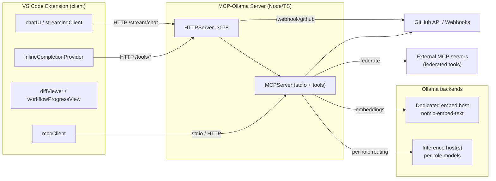

**Key design choice:** inference and embeddings are decoupled. Inference uses
`OLLAMA_HOST` (often a big remote box, routed per agent role); embeddings use
`OLLAMA_EMBED_HOST` (a small instance pinned to a free GPU). This prevents a busy
or OOM inference host from silently degrading semantic search.

---

## 3. Layered architecture

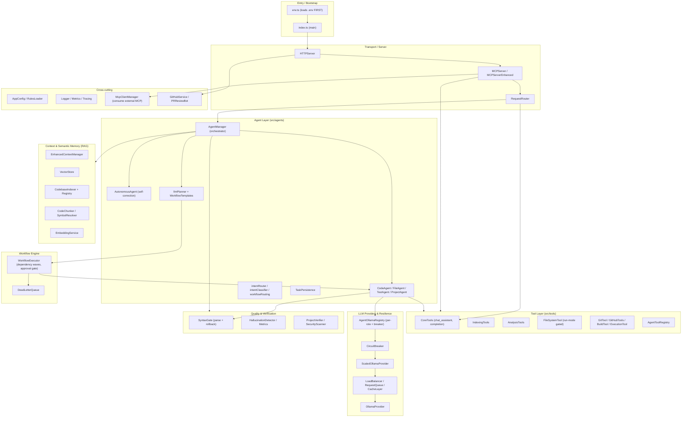

---

## 4. Module reference

### `src/` — server

| Directory | Key files | Responsibility |
|---|---|---|
| `server/` | `HTTPServer`, `MCPServer`, `MCPServerEnhanced`, `RequestRouter` | Transport, tool registry, request classification/routing |
| `agents/` | `AgentManager`, `AutonomousAgent`, `CodeAgent`, `FileAgent`, `TestAgent`, `ProjectAgent`, `llmPlanner`, `intentRouter`, `intentClassifier`, `workflowRouting`, `TaskPersistence`, `projectScanner`, `resolveTargetFiles`, `simpleFsTasks` | Orchestration, planning, specialized agents, intent routing |
| `workflows/` | `WorkflowExecutor`, `WorkflowTemplates`, `DeadLetterQueue` | Multi-step execution with dependencies, approvals, failure capture |
| `tools/` | `CoreTools`, `IndexingTools`, `AnalysisTools`, `FileSystemTool`, `GitTool`, `GitHubTools`, `BuildTool`, `ExecutionTool`, `SearchTools`, `ErrorFixTools`, `InlineTools`, `IDETools`, `AgentToolRegistry`, `AgentToolRegistry`, `ToolDependencies`, `toolAliases` | Concrete capabilities exposed to agents and MCP clients |
| `providers/` | `OllamaProvider`, `AgentOllamaRegistry` | LLM calls; per-role host/model/timeout + circuit breaker wiring |
| `scaling/` | `ScaledOllamaProvider`, `LoadBalancer`, `RequestQueue`, `CacheLayer` | Concurrency control, endpoint balancing, request dedup |
| `indexing/` | `CodebaseIndexer`, `CodebaseIndexerRegistry`, `CodeChunker`, `SymbolResolver`, `EmbeddingService`, `types` | Build & query the semantic code index |
| `semantic/` | `VectorStore` | Facade for semantic search (workspace + ephemeral memory scopes) |
| `context/` | `EnhancedContextManager` | Aggregates retrieved context for prompts |
| `quality/` | `HallucinationDetector`, `HallucinationMetrics`, `QualityFilter` | Output grounding/quality signals |
| `verify/` | `SyntaxGate`, `ProjectVerifier` | Deterministic validation of generated code/projects |
| `security/` | `SecurityScanner` | Static safety checks |
| `mcp/` | `McpClientManager` | Consume/federate external MCP servers |
| `services/` | `GitHubService`, `GitHubRepositoryAnalyzer`, `PRReviewBot` | GitHub API, repo analysis, automated PR review |
| `config/` | `AppConfig`, `RulesLoader` | Env-driven config; project rule injection |
| `utils/` | `Logger`, `Metrics`, `Tracing`, `CircuitBreaker`, `CacheManager`, `TimeoutManager`, `ErrorAnalyzer`, `LargeCodebaseAnalyzer`, `ContextManager`, `DynamicConfig`, `OllamaDefaults` | Cross-cutting helpers |
| `lsp/`, `formatters/` | `LSPClient`, `CodeFormatter` | Language tooling |
| `env.ts` | — | Loads `.env` **before** any other module initializes |

---

## 5. Request lifecycle

Every tool call is classified into one of three lanes by `RequestRouter`.

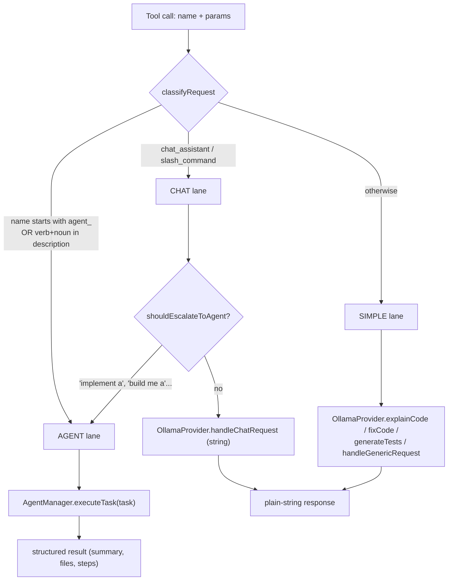

**Classification rules (`RequestRouter`):**

- **AGENT** when the tool name starts with `agent_`, or the description contains
  **both** an action verb (`implement`, `build`, `create`, …) **and** a code
  noun (`api`, `service`, `component`, …). Requiring both prevents conversational
  questions from being misrouted into agent tasks.
- **CHAT** for `chat_assistant` / `slash_command`; may escalate to AGENT only on
  explicit multi-step triggers (`implement a`, `build me a`, …).
- **SIMPLE** for everything else — a single direct LLM call.

### Streaming chat path

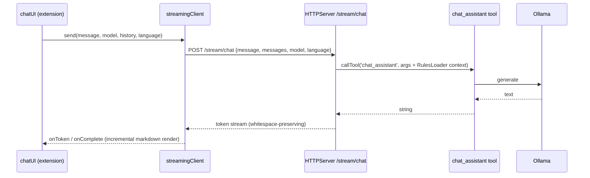

---

## 6. Agent execution & workflow engine

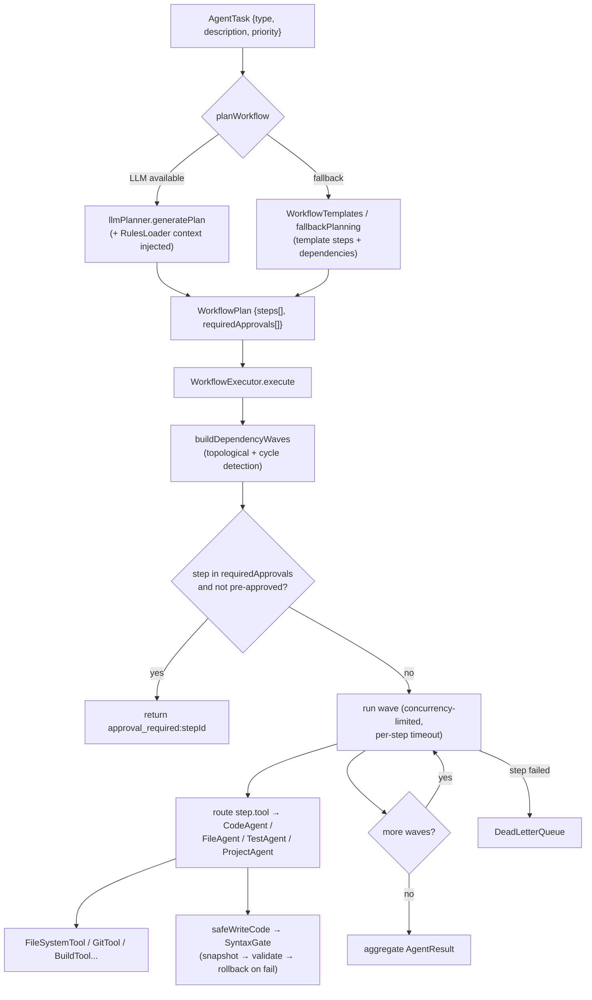

**Concepts:**

- **Dependency waves** — steps are grouped into topologically-ordered waves; a
  `visiting` set detects cycles to prevent infinite loops. Steps within a wave run
  concurrently up to `WORKFLOW_MAX_CONCURRENT_STEPS`, each bounded by
  `WORKFLOW_STEP_TIMEOUT_MS`.
- **Approval gate** — steps listed in `plan.requiredApprovals` (e.g. high-priority
  or `fix`/`refactor` tasks that write files) pause execution and return
  `approval_required:<stepId>` unless pre-approved via `context.autoApprove` or
  `context.approvedSteps`.
- **Dead-letter queue** — failed steps/tasks are captured for inspection/retry
  and surfaced in `/api/stats`.

---

## 7. Autonomous self-correction loop

This is what elevates the system from a pipeline to an agent.

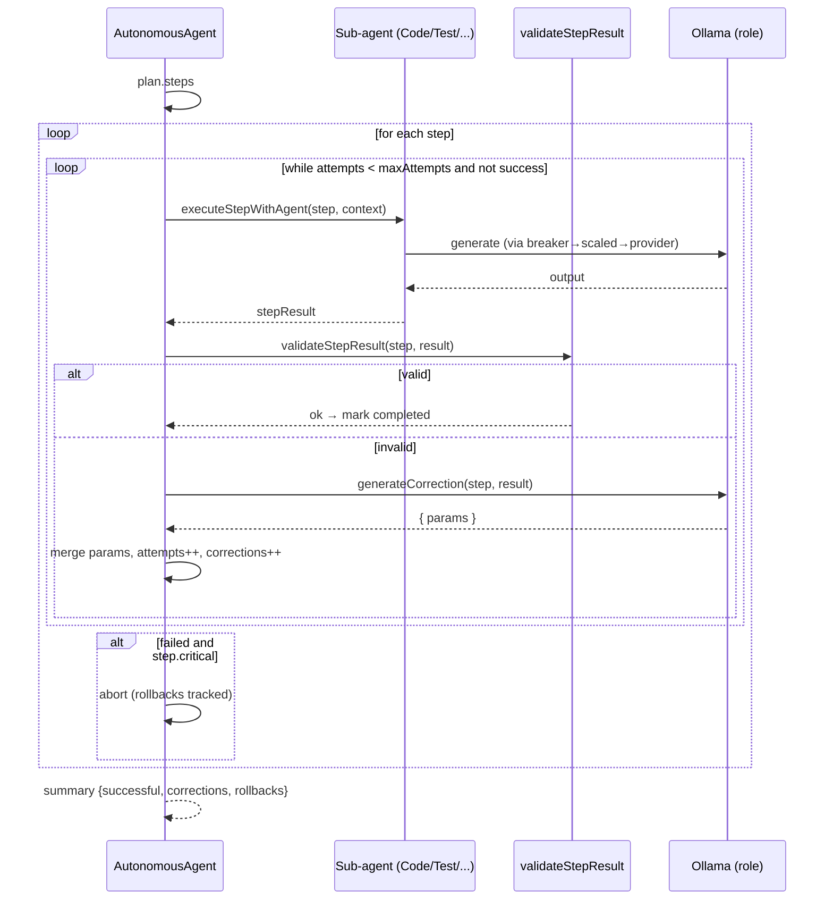

There is also a **fast path** (`executeFastPath`) with a verify/repair loop, and a
**direct path** (`executeDirectly`) for simple tasks. Tasks can be **paused** and
resumed (`waitForResume`).

> **Current limitation:** `generateCorrection` only adjusts step **params**, not
> the **strategy**. Strategy-level re-planning is the highest-leverage future
> improvement (see [Roadmap](#17-known-limitations--roadmap)).

---

## 8. Provider stack: routing, resilience, scaling

Every low-level LLM call flows through this chain, wired in `AgentOllamaRegistry`
via `provider.setRequestGuard(...)`:

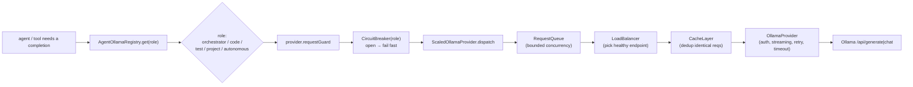

**Concepts:**

- **Per-role providers** — each role (`orchestrator`, `code`, `test`, `project`,
  `autonomous`) gets its own host/model/timeout, overridable via
  `OLLAMA_<ROLE>_HOST` / `_MODEL` / `_TIMEOUT_MS`.
- **Circuit breaker (per role)** — opens after `CIRCUIT_FAILURE_THRESHOLD`
  failures, fails fast for `CIRCUIT_COOLDOWN_MS`, then half-opens and needs
  `CIRCUIT_SUCCESS_THRESHOLD` successes to close. One dead endpoint never blocks
  the others.
- **Scaled dispatch** — a process-wide singleton enforcing bounded concurrency
  (`RequestQueue`), endpoint selection (`LoadBalancer`, health-checked with
  `unref()`'d timers), and identical-request dedup (`CacheLayer`).

### Circuit breaker state machine

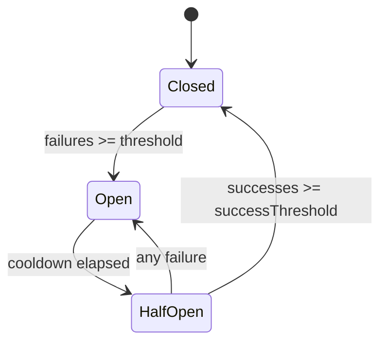

---

## 9. Semantic memory / RAG

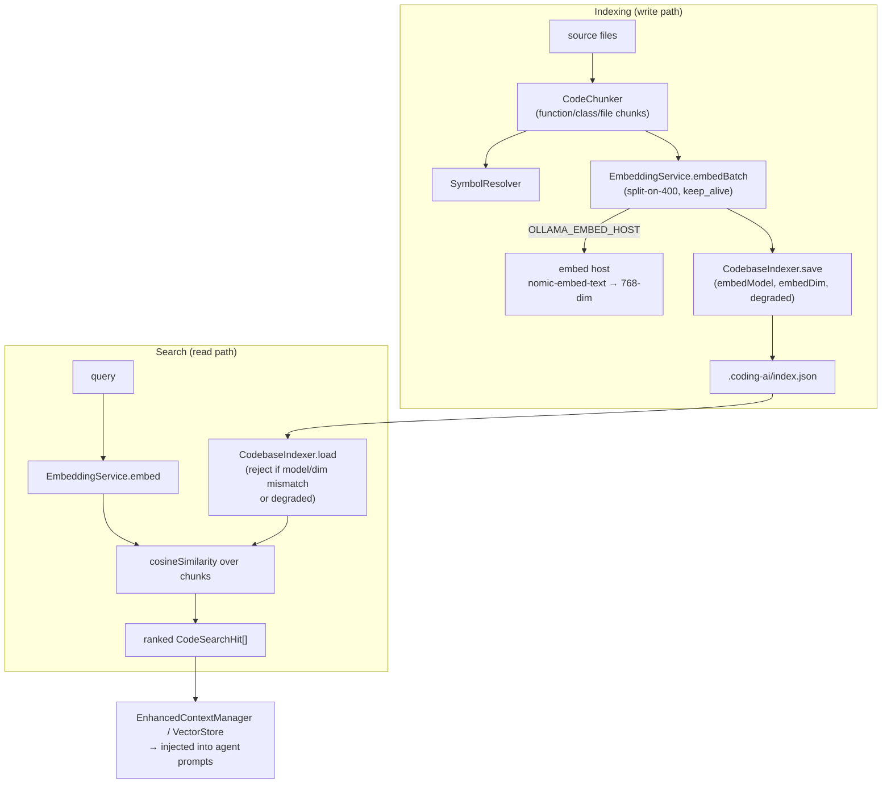

**Invariants (hard-won — see [Roadmap](#17-known-limitations--roadmap)):**

- **Embed-host decoupling** — embeddings target `OLLAMA_EMBED_HOST` (defaults to
  `OLLAMA_HOST`). A dedicated instance on a free GPU keeps semantic search working
  even when inference is busy/OOM.
- **Index self-validation on load** — `CodebaseIndexer.load()` rejects an index if
  its `embedModel` differs from the current model, if chunk dimensions are mixed,
  or if it was persisted while `degraded`. A rejected index triggers a clean
  rebuild, so vectors from different models/dimensions can never silently poison
  `cosineSimilarity` (which compares over `min(len)`).
- **Resilient batching** — `embedBatch` splits oversized batches on HTTP 400 and
  skips genuinely un-embeddable chunks (empty vector, excluded from the index)
  rather than falling the whole batch back to hash. True backend outages still
  degrade to hash vectors and flip `backend = 'fallback'`.
- **`keep_alive`** — embed requests keep the model resident, so a full re-index
  doesn't reload the model between batches.

---

## 10. Quality & verification

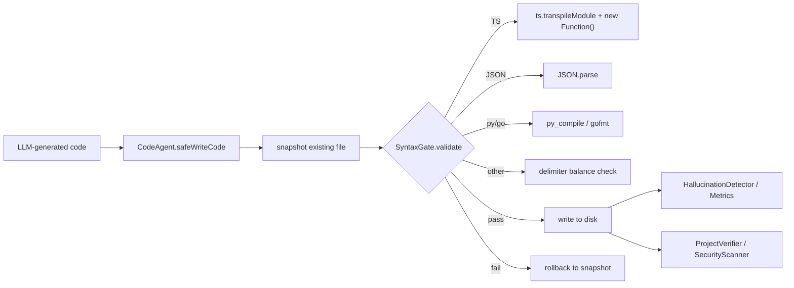

- **SyntaxGate** — deterministic, parser-based validation before writing. Shifts
  correctness from "hope the model is perfect" to "validate and reject bad output."
- **HallucinationMetrics** — grounding signals aggregated and exposed at `/health`.

---

## 11. Configuration & bootstrap order

### Critical startup order

ES `import` statements are hoisted above inline code, so config must be loaded by
the **first** import or import-time singletons (e.g. `intentRouter` creates a
`VectorStore` → shared `EmbeddingService`) capture default env.

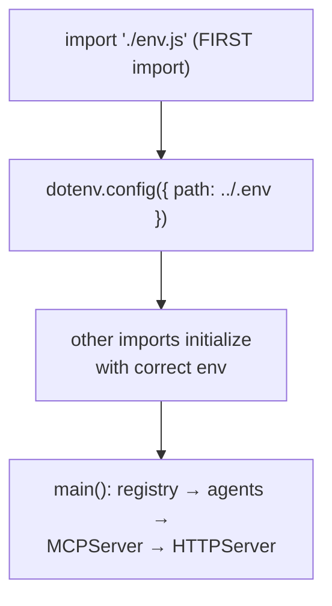

### Key environment variables

| Variable | Purpose |
|---|---|
| `OLLAMA_HOST` | Base inference host |
| `OLLAMA_EMBED_HOST` | Dedicated embeddings host (defaults to `OLLAMA_HOST`) |
| `OLLAMA_EMBED_MODEL` | Embedding model (default `nomic-embed-text`) |
| `OLLAMA_<ROLE>_HOST/_MODEL/_TIMEOUT_MS` | Per-role overrides (`ORCHESTRATOR`/`CODE`/`TEST`/`PROJECT`/`AUTONOMOUS`) |
| `OLLAMA_AUTH_TOKEN` | Bearer token for protected Ollama endpoints |
| `OLLAMA_ALLOWED_HOSTS` | Host allowlist |
| `CIRCUIT_FAILURE_THRESHOLD` / `CIRCUIT_COOLDOWN_MS` / `CIRCUIT_SUCCESS_THRESHOLD` | Circuit breaker tuning |
| `WORKFLOW_MAX_CONCURRENT_STEPS` / `WORKFLOW_STEP_TIMEOUT_MS` | Workflow concurrency/timeouts |
| `PORT` / `MCP_SERVER_PORT` | HTTP port (default `3078`) |
| `HTTP_REQUEST_TIMEOUT_MS` | Socket timeout (default 300s) |
| `RUN_MODE` | `full` / `restricted` / `read-only` for `FileSystemTool` |
| `GITHUB_TOKEN` | GitHub API auth |

`RulesLoader` additionally injects project instructions from `AGENTS.md`,
`.coding-ai/rules/*.md`, and `.cursor/rules/*.mdc` into agent and chat prompts.

---

## 12. Observability & HTTP surface

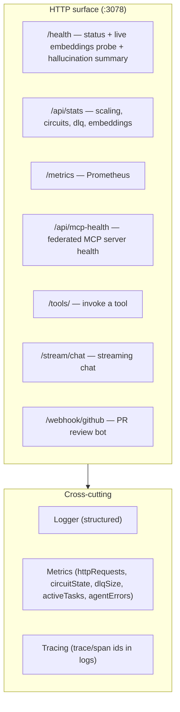

`/health.embeddings` runs a cached (30s) live embed probe and reports
`{ backend, healthy, host, model, dimensions }`, so degradation to the hash
fallback is observable instead of silent.

---

## 13. VS Code extension

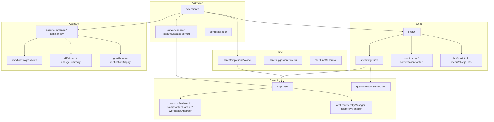

The extension connects to the server over HTTP (and MCP), streams chat tokens
with incremental markdown rendering, provides inline completions, shows workflow
progress, and renders diffs/approvals for agent changes.

---

## 14. External integrations

- **GitHub** — `GitHubService` (PR diff/review/inline comments), `PRReviewBot`
  (webhook-driven automated review using Ollama), `GitHubRepositoryAnalyzer`.
- **External MCP servers** — `McpClientManager` connects to other MCP servers and
  exposes their tools as local federated tools (`server/tool` naming), surfaced in
  `handleListTools` and dispatched in `handleCallTool`.

---

## 15. Concept glossary

| Concept | Where | What it does |
|---|---|---|
| Per-role provider | `AgentOllamaRegistry` | Separate Ollama host+model+timeout per agent role |
| Circuit breaker | `CircuitBreaker` | Per-role fail-fast with cooldown + half-open probing |
| Scaled dispatch | `ScaledOllamaProvider` + `RequestQueue`/`LoadBalancer`/`CacheLayer` | Bounded concurrency, endpoint selection, request dedup |
| Dependency waves | `WorkflowExecutor` | Topological parallel batches; cycle detection |
| Approval gate | `WorkflowExecutor` + `requiredApprovals` | Pause high-risk write steps until approved |
| Run-mode gating | `FileSystemTool` | `full`/`restricted`/`read-only`; command allowlist |
| Syntax gate | `SyntaxGate` | Snapshot → parse-validate → rollback before write |
| Dead-letter queue | `DeadLetterQueue` | Capture failed tasks/steps for inspection/retry |
| Self-correction | `AutonomousAgent` | Validate → LLM correction → retry with backoff |
| Intent routing | `intentRouter` / `RequestRouter` | SIMPLE/CHAT/AGENT classification |
| Rules injection | `RulesLoader` | Loads `AGENTS.md`/`.coding-ai`/`.cursor` rules into prompts |
| Embed-host decoupling | `EmbeddingService` + `OLLAMA_EMBED_HOST` | Embeddings on a dedicated GPU/host |
| Index self-validation | `CodebaseIndexer.load/save` | Reject model/dimension-mismatched or degraded indexes |
| keep_alive / split-on-400 | `EmbeddingService` | Keep embed model resident; recover oversized batches |
| Federation | `McpClientManager` | Expose external MCP tools locally |
| Observability | `Logger`/`Metrics`/`Tracing` | Structured logs, Prometheus metrics, trace correlation |

---

## 16. Operations runbook

### Build & run

```bash
npm install
npm run build        # tsc → dist/
npm run dev          # tsc --watch + nodemon (single instance!)
# or, stable foreground:
node dist/index.js
```

> Run **one** dev watcher. Multiple `npm run dev` instances fight over port 3078
> and can kill in-flight indexing on restart.

### Dedicated embedding server (recommended)

```bash
CUDA_VISIBLE_DEVICES=1 OLLAMA_HOST=127.0.0.1:11533 \
  OLLAMA_MODELS=$HOME/.ollama/models ollama serve
# then in .env:
# OLLAMA_EMBED_HOST=http://127.0.0.1:11533
```

> Not reboot-durable by default — wrap in a systemd unit for persistence.

### Health checks

```bash
curl -s localhost:3078/health   | jq .embeddings   # expect backend: "ollama"
curl -s localhost:3078/api/stats | jq '{circuits, dlq, embeddings}'
curl -s localhost:3078/metrics                      # Prometheus
```

### Re-index a workspace

```bash
curl -s -X POST localhost:3078/tools/index_codebase \
  -H 'Content-Type: application/json' \
  -d '{"workspacePath":"/abs/path","force":true}'
```

### Tests

```bash
npm test   # node:test runner; some live-integration tests require a reachable Ollama
```

---

## 17. Known limitations & roadmap

**Limitations (honest):**

- Self-correction adjusts params, not strategy — no true re-planning on failure.
- Planning is partly template-driven for novel tasks.
- Step validation signals are uneven; weak validators weaken the correction loop.
- Memory is per-task retrieval; no cross-task learning.
- Embedding server isn't reboot-durable out of the box.

**Roadmap (highest leverage first):**

1. **Strategy-level re-planning** in the self-correction loop (biggest "intelligence" gain).
2. **Stronger verification signals** (extend `SyntaxGate` → tests/build as gates).
3. **Cross-task memory** (persistent lessons / outcomes).
4. **Durable embed server** (systemd unit) + auto-reindex on model change.

---

*This document reflects the current wiring in `src/`. When you change routing,
add a tool, or alter the provider/embedding stack, update the relevant diagram
and the [module reference](#4-module-reference).*
