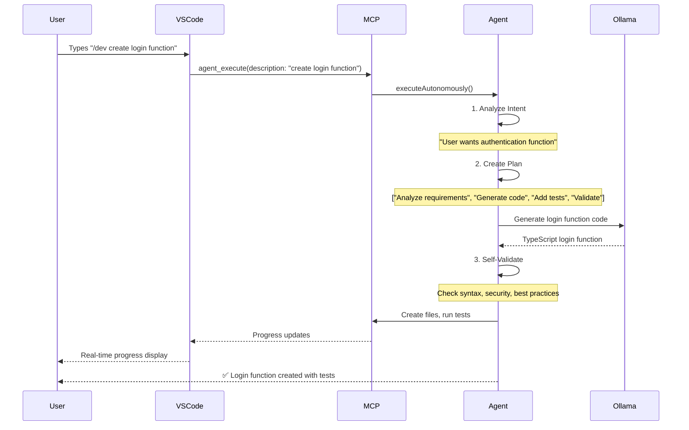

# MCP Ollama Project Architecture

## 🏗️ High-Level Architecture

```
┌─────────────────────────────────────────────────────────────────┐
│                    VS Code Extension                            │
│  ┌─────────────────┐  ┌─────────────────┐  ┌─────────────────┐ │
│  │   Chat UI       │  │  Agent Commands │  │  Inline Suggest │ │
│  │  (Ctrl+Shift+M) │  │ (/dev /test)    │  │   (Ghost Text)  │ │
│  └─────────────────┘  └─────────────────┘  └─────────────────┘ │
└─────────────────────────────────────────────────────────────────┘
                                │
                                │ MCP Protocol
                                ▼
┌─────────────────────────────────────────────────────────────────┐
│                    MCP Server (Node.js)                        │
│  ┌─────────────────┐  ┌─────────────────┐  ┌─────────────────┐ │
│  │  Request Router │  │  Agent Manager  │  │  Tool Registry  │ │
│  │   (Intelligent) │  │  (Autonomous)   │  │   (80+ Tools)   │ │
│  └─────────────────┘  └─────────────────┘  └─────────────────┘ │
│  ┌─────────────────┐  ┌─────────────────┐  ┌─────────────────┐ │
│  │ Context Manager │  │  Cache Layer    │  │ Security Scanner│ │
│  │  (Multi-file)   │  │  (Performance)  │  │  (Vulnerability)│ │
│  └─────────────────┘  └─────────────────┘  └─────────────────┘ │
└─────────────────────────────────────────────────────────────────┘
                                │
                                │ HTTP/WebSocket
                                ▼
┌─────────────────────────────────────────────────────────────────┐
│                Remote Ollama Server                             │
│              http://10.10.110.25:11434                         │
│  ┌─────────────────┐  ┌─────────────────┐  ┌─────────────────┐ │
│  │ deepseek-coder  │  │   llama3.3:70b  │  │    phi4:latest  │ │
│  │     v2:236b     │  │   (Reasoning)   │  │   (Fast Code)   │ │
│  └─────────────────┘  └─────────────────┘  └─────────────────┘ │
└─────────────────────────────────────────────────────────────────┘
```

## 🔧 Core Components

### 1. **VS Code Extension** (`vscode-extension/`)
- **Purpose**: User interface and IDE integration
- **Key Files**:
  - `extension.ts` - Main extension entry point
  - `copilotChatProvider.ts` - Chat interface
  - `agentCommands.ts` - Agent command handlers
  - `inlineCompletionProvider.ts` - Real-time suggestions

### 2. **MCP Server** (`src/server/`)
- **Purpose**: Core AI processing and tool orchestration
- **Key Files**:
  - `MCPServer.ts` - Main server with 80+ tools
  - `MCPServerEnhanced.ts` - Enhanced features
  - `HTTPServer.ts` - REST API endpoints

### 3. **Agent System** (`src/agents/`)
- **Purpose**: Autonomous task execution
- **Key Files**:
  - `AutonomousAgent.ts` - Amazon Q-style autonomous execution
  - `AgentManager.ts` - Task orchestration
  - `CodeAgent.ts` - Code-specific operations

### 4. **Ollama Provider** (`src/providers/`)
- **Purpose**: AI model communication
- **Key Files**:
  - `OllamaProvider.ts` - Model interaction layer
  - `ScaledOllamaProvider.ts` - Load balancing

## 📊 Data Flow Example

### Example: User Types `/dev create a login function`



## 🛠️ Tool Categories (80+ Tools)

### **Core Development Tools**
```typescript
// Code completion and generation
code_completion, code_generation, code_explanation

// Error fixing and debugging  
auto_error_fix, quick_fix, batch_error_fix, validate_fix

// Code analysis and review
code_analysis, diagnose_code, security_scan, code_review
```

### **Agent Commands**
```typescript
// Autonomous execution
autonomous_execute, smart_implement, smart_debug

// Planning and status
agent_plan, agent_status, complex_workflow
```

### **GitHub Integration**
```typescript
// Repository operations
github_repo_info, github_file_content, github_search_code

// Smart queries
github_smart_query, github_analyze_repository
```

### **Advanced Features**
```typescript
// Multi-model consensus
multi_model_consensus, ai_pair_programming

// Real-time collaboration
conversation_memory, collaboration, analytics
```

## 🔄 Autonomous Agent Workflow

### 4-Phase Execution Model

```typescript
interface AutonomousExecution {
  phases: {
    1: "Intent Analysis"    // Understand what user wants
    2: "Planning"          // Break down into steps  
    3: "Execution"         // Implement with validation
    4: "Self-Correction"   // Fix issues autonomously
  }
}
```

### Example: Autonomous Bug Fix

```typescript
// User: "Fix the authentication bug in login.ts"

// Phase 1: Intent Analysis
const intent = {
  task: "debug_and_fix",
  target: "authentication system", 
  file: "login.ts",
  priority: "high"
}

// Phase 2: Planning  
const plan = [
  "Read and analyze login.ts",
  "Identify authentication logic issues", 
  "Generate fix with security validation",
  "Create backup and apply fix",
  "Run tests to verify fix"
]

// Phase 3: Execution with Self-Correction
for (const step of plan) {
  const result = await executeStep(step)
  if (!result.success) {
    await selfCorrect(step, result.error)
  }
}

// Phase 4: Validation
const validation = await validateFix(originalCode, fixedCode)
if (!validation.isValid) {
  await rollbackAndRetry()
}
```

## 🌐 Network Architecture

### Remote Ollama Configuration
```typescript
// Default configuration
const config = {
  host: "http://10.10.110.25:11434",  // Remote Ollama server
  models: [
    "deepseek-coder-v2:236b",         // Primary coding model
    "llama3.3:70b",                   // Reasoning tasks
    "phi4:latest"                     // Fast responses
  ],
  fallback: "localhost:11434"         // Local fallback
}
```

### Load Balancing & Scaling
```typescript
// Multiple model strategy
const multiModelExecution = {
  strategy: "consensus",              // Get agreement from multiple models
  models: ["deepseek-coder", "llama3.3", "phi4"],
  timeout: 30000,                     // 30 second timeout
  fallback: "best_available"          // Use best performing model
}
```

## 📁 Project Structure

```
mcp-ollama/
├── src/
│   ├── agents/           # Autonomous agents
│   │   ├── AutonomousAgent.ts
│   │   ├── AgentManager.ts
│   │   └── CodeAgent.ts
│   ├── server/           # MCP server core
│   │   ├── MCPServer.ts
│   │   └── HTTPServer.ts
│   ├── providers/        # AI model providers
│   │   └── OllamaProvider.ts
│   ├── tools/           # Tool implementations
│   │   ├── FileSystemTool.ts
│   │   └── GitTool.ts
│   └── types/           # TypeScript definitions
├── vscode-extension/    # VS Code extension
│   ├── src/
│   │   ├── extension.ts
│   │   ├── copilotChatProvider.ts
│   │   └── agentCommands.ts
│   └── package.json
└── examples/           # Usage examples
```

## 🚀 Key Features

### **Amazon Q-Style Autonomous Agents**
- Self-planning and execution
- Error correction and retry logic
- Multi-step workflow management
- Real-time progress tracking

### **GitHub Copilot-Like Experience**
- Inline code suggestions with ghost text
- Chat-based assistance (Ctrl+Shift+M)
- Slash commands (/dev, /test, /review)
- Context-aware completions

### **Advanced AI Capabilities**
- Multi-model consensus for better accuracy
- Conversation memory for context retention
- Real-time collaboration features
- Code health monitoring

### **Enterprise Features**
- Security scanning and vulnerability detection
- Usage analytics and telemetry
- Team collaboration tools
- Policy enforcement

## 🔧 Configuration

### Environment Variables
```bash
# Ollama Configuration
OLLAMA_HOST=http://10.10.110.25:11434
OLLAMA_MODEL=deepseek-coder-v2:236b

# Server Configuration  
MCP_SERVER_PORT=3077
USE_HTTPS=true

# Performance Tuning
MAX_CONCURRENT_REQUESTS=10
CACHE_TTL_HOURS=24
REQUEST_TIMEOUT_MS=30000
```

### VS Code Settings
```json
{
  "mcp-ollama.enabled": true,
  "mcp-ollama.host": "http://10.10.110.25:11434",
  "mcp-ollama.model": "deepseek-coder-v2:236b",
  "mcp-ollama.enableAgentCommands": true,
  "mcp-ollama.showWorkflowProgress": true
}
```

## 📈 Performance & Scaling

### Caching Strategy
- **Request Cache**: 5-minute TTL for code completions
- **Context Cache**: 1-hour TTL for project analysis  
- **Conversation Memory**: Persistent with vector search
- **Model Response Cache**: 24-hour TTL for static queries

### Load Balancing
- **Round-robin** model selection
- **Fallback chains** for reliability
- **Request queuing** for high load
- **Circuit breakers** for failed models

## 🔒 Security Features

### Code Security Scanning
```typescript
const securityScan = {
  checks: [
    "SQL injection vulnerabilities",
    "XSS attack vectors", 
    "Authentication bypasses",
    "Sensitive data exposure",
    "Insecure dependencies"
  ],
  severity: ["critical", "high", "medium"],
  autoFix: true
}
```

### Privacy Protection
- **Local processing** when possible
- **Anonymized telemetry** 
- **No code storage** on external servers
- **Encrypted communications**

## 🎯 Usage Examples

### 1. **Autonomous Feature Implementation**
```bash
# User command in VS Code chat
/dev "Create a REST API for user management with CRUD operations"

# Agent automatically:
# 1. Analyzes requirements
# 2. Creates file structure  
# 3. Implements endpoints
# 4. Adds validation & tests
# 5. Updates documentation
```

### 2. **Smart Debugging**
```bash
# User selects error and runs
/debug "TypeError: Cannot read property 'id' of undefined"

# Agent automatically:
# 1. Analyzes stack trace
# 2. Identifies root cause
# 3. Generates fix with null checks
# 4. Validates fix doesn't break other code
# 5. Applies fix with backup
```

### 3. **Code Review & Optimization**
```bash
# User runs on selected code
/review "Check this function for performance issues"

# Agent provides:
# 1. Performance analysis
# 2. Security vulnerability scan
# 3. Code quality assessment  
# 4. Optimization suggestions
# 5. Refactored code examples
```

This architecture provides a comprehensive AI coding assistant that combines the autonomous capabilities of Amazon Q Developer with the user experience of GitHub Copilot, all powered by your remote Ollama infrastructure.